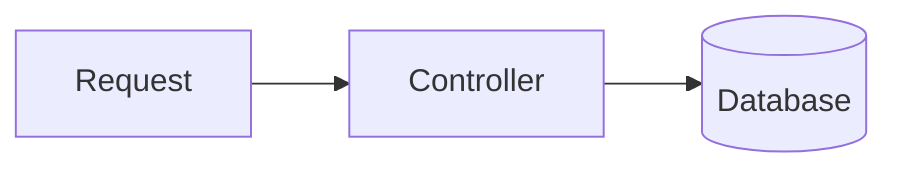

# mdBook Template

A starting point for **interactive** [mdBook](https://rust-lang.github.io/mdBook/)
sites, especially learning guides. Out of the box you get a polished theme
(five mdBook color themes, tuned for contrast) and a set of widgets:
Overview / Deep / Drill level tabs, quizzes, flashcards, side-by-side code
compares, self-checks, a progress map, a pace planner, an animated layer
explorer, a numbered code walkthrough, themed, zoomable Mermaid diagrams,
a three-way diff view, and a history timeline. Everything is driven by
markup in your Markdown pages, so **writing a book never requires
touching JavaScript**.

The book in `src/` is both a demo and the documentation: a worked example
chapter, a live component gallery with copy-paste markup, and a writing
guide.

## Contents

- [Quick start](#quick-start)
- [Project layout](#project-layout)
- [Component reference](#component-reference)
  - [Callouts](#callouts) · [Tables](#tables) · [Checklist](#checklist)
  - [Level tabs](#level-tabs) · [Self-check](#self-check-mark-as-known) · [Mark done](#mark-this-chapter-done)
  - [Quiz](#quiz) · [Flashcards](#flashcards) · [Code compare](#code-compare)
  - [Progress map](#progress-map) · [Pace chooser](#pace-chooser) · [Layer explorer](#layer-explorer)
  - [Code walkthrough](#code-walkthrough) · [Mermaid diagram](#mermaid-diagram) · [Diff view](#diff-view) · [Timeline](#timeline)
- [Keyboard shortcuts](#keyboard-shortcuts)
- [Recoloring](#recoloring)
- [Configuration and storage](#configuration-and-storage)
- [Opting out of a widget](#opting-out-of-a-widget)
- [Authoring gotchas](#authoring-gotchas)
- [Technical notes](#technical-notes)
- [Tests](#tests)

## Quick start

1. **Create your repo**: click **Use this template** on GitHub.
2. **Name your book**: edit `title` / `authors` in `book.toml`, and set
   `storagePrefix` in `theme/book-config.js` to a unique slug (for example
   `"git-guide"`). Two books on the same domain would otherwise share
   readers' progress.
3. **Write chapters**: copy `templates/chapter.md` to `src/your-chapter.md`,
   add it to `src/SUMMARY.md` and to the progress map in `src/README.md`.
   Browse `src/components.md` (or the rendered *Component gallery*) for
   every widget's markup. Delete the demo pages you don't want.
4. **Preview**: `mdbook serve --open` (mdBook **v0.5.4**), or
   `docker compose up --build` and open <http://localhost:8080>.
5. **Publish**:
   - **GitHub Pages**: in the repo, *Settings → Pages → Source: GitHub
     Actions*, and set `site-url = "/<repo>/"` in `book.toml`. Every push to
     `master` runs the tests, builds, and deploys
     (`.github/workflows/deploy.yml`).
   - **Docker**: the `Dockerfile` builds the book and serves it with nginx
     on port 80 (`docker-compose.yml` maps it to 8080).
   - **Anywhere else**: `mdbook build` and upload the `book/` folder.

## Project layout

```text
book.toml                 title, themes, site-url, ordered CSS/JS list
theme/
  book-config.js          window.BookConfig: storagePrefix (+ optional trackedChapters)
  custom.css              design tokens (recolor here) + base look
  interactive.css         widget styles
  head.hbs                IBM Plex Sans/Mono (mdBook injects it into <head>)
  celebrate.js            confetti + toasts (window.Book.celebrate/toast)
  levels.js               level tabs
  checkmarks.js           mark done, sidebar ✓, mark as known, checklist memory
  on-this-page.js         fixed "On this page" nav with scroll-spy
  quiz.js  flashcards.js  code-compare.js  progress-map.js
  pace-chooser.js  layer-explorer.js
  code-walk.js            annotated code walkthrough
  mermaid-diagram.js       themed, zoomable Mermaid diagrams (lazy-loads mermaid from a CDN)
  diff-view.js            Before / Diff / After view of one patch
  timeline.js             a markdown list as a vertical dated timeline
  *.test.js               node:test unit tests for the pure helpers
src/                      the book (welcome, example chapter, gallery, writing guide)
templates/chapter.md      copy-paste starter for a new chapter (not built)
CLAUDE.md                 instructions for AI assistants working on a book
```

## Component reference

Every snippet below is live in `src/components.md`. "Blank lines" means a
blank line right after the opening tag and right before the closing tag,
so mdBook renders the Markdown inside (see [gotchas](#authoring-gotchas)).

### Callouts

Classes: `callout` + one of `note` (info), `setup` (prerequisites),
`rule` (a principle), `danger` (a gotcha); `callout-label` for the title.

```html
<div class="callout danger">
<div class="callout-label">Gotcha</div>

Markdown **works** here.

</div>
```

### Tables

Plain Markdown tables are styled automatically (mdBook 0.5 already wraps
them in a scrolling `.table-wrapper`). Wrapping in `.table-wrap` is
optional and keeps the same framed look on other mdBook versions.

```html
<div class="table-wrap">

| Term | Meaning |
|---|---|
| a | b |

</div>
```

### Checklist

`ul.checklist`; ticks are remembered per page.

```html
<ul class="checklist">
<li><label><input type="checkbox"><span>A task, in HTML.</span></label></li>
</ul>
```

### Level tabs

One `.level-tabs[data-levels]` bar per page; buttons with
`data-level="overview|deep|drill"`; content in `.level.overview`,
`.level.deep`, `.level.drill`. The level names are fixed, the button text
is yours (e.g. "Quick look" / "In depth" / "Practice"). Optional
`data-short` is the label on phones. The drill tab gets a badge counting
its checklist items, self-checks, quizzes and flashcard decks. The choice
is remembered across chapters, and links to a heading in a hidden level
switch to that level.

```html
<div class="level-tabs" data-levels>
  <button data-level="overview" aria-pressed="true">Overview</button>
  <button data-level="deep" data-short="Deep">Deep Understanding</button>
  <button data-level="drill">Drilling</button>
</div>

<div class="level overview">

Markdown...

</div>
```

### Self-check ("Mark as known")

`details.qa` with a `summary` and a `div.ans`; the optional `div.mark`
button toggles a remembered "known" state.

```html
<details class="qa">
<summary>Self-check: the question?</summary>
<div class="ans">
The answer.
<div class="mark"><button type="button">Mark as known</button></div>
</div>
</details>
```

### Mark this chapter done

`[data-mark-done]`: one per chapter (usually at the end of the drill level).
On pages with level tabs it moves into the fixed tab bar. It adds a ✓ to
the sidebar, updates progress maps, and celebrates with
"Chapter done! N of M complete" (M = chapters in a progress map on the
page, else `BookConfig.trackedChapters`, else the last progress map the
reader saw; with none, just "Chapter done!"). Optional `data-done-text`.

```html
<button type="button" data-mark-done>Mark this chapter done</button>
```

### Quiz

`.quiz[data-quiz]` with `.quiz-q`, `ol.quiz-options` (mark the right `li`
with `data-correct`) and an optional `.quiz-explain` shown once solved. A
scoreboard appears above the page's first quiz; a perfect score gets
confetti.

```html
<div class="quiz" data-quiz>
<p class="quiz-q">The question?</p>
<ol class="quiz-options">
<li>Wrong</li>
<li data-correct>Right</li>
</ol>
<p class="quiz-explain">Why.</p>
</div>
```

### Flashcards

`.flashcards[data-flashcards]` containing `.card` > `.front` + `.back`.
Optional `data-front-label` / `data-back-label` (default "Question" /
"Answer") and `data-title` (default "Flashcards").

```html
<div class="flashcards" data-flashcards data-front-label="Term" data-back-label="Meaning">
<div class="card"><div class="front">Front</div><div class="back">Back</div></div>
</div>
```

### Code compare

`.code-compare[data-code-compare]` around 2–4 fenced code blocks (blank
lines!). Side by side when wide (2 panes from 620px, 3–4 from 900px), tabs
when narrow. Labels come from the language (`csharp` → C#, `py` → Python,
`ts` → TypeScript, `sh` → Shell, ...; unknown languages show their raw name).
Optional `data-labels="Before|After"`, `data-subs="v1|v2"` (grey
sub-labels), `data-default="1"` (1-based pane shown first on narrow
screens; default is the last pane).

````html
<div class="code-compare" data-code-compare data-labels="Before|After">

```js
old()
```

```js
new()
```

</div>
````

### Progress map

`[data-progress-map]` around a Markdown list of **Markdown links** (blank
lines!); text after the link is the blurb. Shows done / up next /
"Continue where you left off". Optional `data-title` ("Your progress"),
`data-label` ("Chapter"), `data-done-text`. Up to 7 stops draw as a
horizontal road on wide screens; longer lists stay vertical.

```html
<div data-progress-map>

- [Chapter one](chapter-one.md) Short blurb
- [Chapter two](chapter-two.md) Short blurb

</div>
```

### Pace chooser

`.pace-chooser[data-pace-chooser]` with a hidden `ul.pc-tasks` of
`li[data-hours]`. The widget builds "hours per week" and "weeks available"
sliders and a week-by-week timeline; tasks larger than a week are split
into "part 1/2" and so on, and a shortfall is reported in hours. Text
before a colon is the short bar label (or set `data-short` on the `li`).
Optional `data-max-hours` (15), `data-max-weeks` (12),
`data-default-hours` (4), `data-default-weeks` (4).

```html
<div class="pace-chooser" data-pace-chooser>
<ul class="pc-tasks">
<li data-hours="6">Part 1: Basics</li>
<li data-hours="8">Part 2: Going deeper</li>
</ul>
</div>
```

### Layer explorer

`.layer-explorer[data-layer-explorer]` with `.layer` children:
`data-name` (required), `data-tag` (chip), `data-trace` (caption during
the trace), inner HTML = the detail card. On the container:
`data-entry` / `data-exit` (end nodes; omitted when absent),
`data-return` (caption for the way back), `data-trace-label` (button
text). `` `backticks` `` in those attributes render as code.

```html
<div class="layer-explorer" data-layer-explorer data-entry="HTTP request" data-exit="Database">
<div class="layer" data-name="Controller" data-tag="routing" data-trace="The request lands here.">
<p>Detail HTML shown in the card.</p>
</div>
</div>
```

### Code walkthrough

`.code-walk[data-code-walk]` around a single fenced code block (blank
lines!) plus a plain `<ol>` of explanations. Mark the line a note is
about with a trailing `(N)` inside a comment — `//`, `#`, `--`, `;`, `%`,
`/* */` and `<!-- -->` are all recognized, so it works across languages.
N is 1-based and must match that note's position in the list. Each
marker becomes a small clickable badge; clicking one (or pressing its
digit key) opens that note in a card below the code. "Expand all" shows
every note at once. Without JavaScript it still reads as code followed
by a numbered list.

````html
<div class="code-walk" data-code-walk>

```js
function clamp(value, min, max) { // (1)
  if (value < min) return min;    // (2)
  return value;
}
```

1. Guard clauses instead of nested `if`/`else`.
2. Returns as soon as the lower bound is violated.

</div>
````

### Mermaid diagram

A plain ` ```mermaid ` fenced code block — no wrapper markup at all, the
same convention every other mermaid-aware tool uses. `mermaid-diagram.js`
lazy-loads [Mermaid](https://mermaid.js.org/) from a CDN only on pages
that actually contain one, themes it from the book's own `--ia-*`/`--bg`/
`--fg` tokens (so it matches whichever of the 5 mdBook themes the reader
has picked), and re-renders automatically the instant they switch themes.
Zoom with the toolbar buttons, <kbd>Ctrl</kbd>/<kbd>Cmd</kbd>+scroll, or
<kbd>+</kbd>/<kbd>-</kbd>/<kbd>0</kbd> when the diagram is focused; drag
to pan. The `</>` button reveals the raw diagram source. A bad diagram
shows a themed error card instead of Mermaid's default output.

````markdown

````

### Diff view

`.diff-view[data-diff-view]` around one fenced ` ```diff ` block (blank
lines!). Three tabs: **Before**, **Diff**, **After**. Paste raw
`git diff` output directly — `diff --git`/`index `/`--- `/`+++ `/`@@`
lines are recognized and dropped from every view. Optional
`data-labels="Before|Diff|After"`, `data-default="before|diff|after"`
(default `diff`). Use **code compare** instead for two complete,
independently-written blocks; diff view is for a single small patch.

````html
<div class="diff-view" data-diff-view>

```diff
 unchanged line
-old line
+new line
```

</div>
````

### Timeline

`.timeline[data-timeline]` around a plain Markdown list (blank lines!).
Each item's leading `**bold**` text is the stop's label; the rest is its
body (inline Markdown like `code` or links works). Renders as a vertical
line of dots — every entry's full text stays visible, nothing collapses.
Optional `data-title`. "Oldest"/"Latest" buttons jump to either end.

```html
<div class="timeline" data-timeline data-title="Project history">

- **2024-01** First working prototype.
- **2024-06** Rewritten as a proper CLI.

</div>
```

## Keyboard shortcuts

| Where | Keys |
|---|---|
| Any page with level tabs | <kbd>1</kbd> <kbd>2</kbd> <kbd>3</kbd> switch Overview / Deep / Drill |
| Focus inside a quiz | <kbd>A</kbd>–<kbd>H</kbd> pick an option |
| Focus on a flashcard deck | <kbd>Space</kbd>/<kbd>Enter</kbd> flip, <kbd>→</kbd> got it, <kbd>←</kbd> again, <kbd>S</kbd> shuffle, <kbd>R</kbd> restart |
| Code compare tabs (narrow) | <kbd>←</kbd> <kbd>→</kbd> switch panes |
| Layer explorer | <kbd>↑</kbd> <kbd>↓</kbd> <kbd>Home</kbd> <kbd>End</kbd> move between layers |
| Focus on a code-walk badge | <kbd>←</kbd> <kbd>↑</kbd> <kbd>→</kbd> <kbd>↓</kbd> move between notes, digit keys jump to one |
| Focus on a Mermaid diagram | <kbd>+</kbd> <kbd>-</kbd> zoom, <kbd>0</kbd> reset, drag to pan, <kbd>Ctrl</kbd>/<kbd>Cmd</kbd>+scroll to zoom |
| Diff view tabs | <kbd>←</kbd> <kbd>→</kbd> switch Before/Diff/After |
| Focus on a timeline dot | <kbd>↑</kbd> <kbd>↓</kbd> <kbd>Home</kbd> <kbd>End</kbd> move between stops |

Level keys are ignored while typing or when focus is in a quiz or deck.

## Recoloring

All colors live in the token block at the top of `theme/custom.css`:

- `--brand-1..4`: raw brand hues used only for decoration (title
  underline, sliders, "done" badges, pace chooser bars).
- `--bk-confetti`: the confetti palette (a comma-separated color list read
  by `celebrate.js`).
- Per-theme blocks (`:root`/`html.light`, `html.rust`, `html.navy`,
  `html.coal`, `html.ayu`): `--bk-accent`, `--bk-accent-2`, `--bk-ok`,
  `--bk-warn`, `--bk-danger` are used for text and borders, so keep them
  readable (>= 4.5:1) against each theme's background, plus surfaces,
  borders, shadow and focus ring.

`interactive.css` only reads these tokens, so it never needs editing.
Fonts (IBM Plex Sans/Mono) are loaded in `theme/head.hbs`; change the
`--font-sans` / `--font-mono` tokens if you swap them.

## Configuration and storage

`theme/book-config.js` defines `window.BookConfig`:

- `storagePrefix` (**change per book**): prefix of every localStorage key:
  `<prefix>:level`, `<prefix>:done:<slug>`, `<prefix>:known:<slug>:<n>`,
  `<prefix>:check:<slug>:<n>`, `<prefix>:tracked`.
- `trackedChapters` (optional): slugs (file names without `.md`) counted
  in "N of M chapters done".

Progress never leaves the reader's browser. Every storage access is
wrapped in try/catch, so private modes that block storage just lose
persistence. Widgets announce changes with `book:level-changed` and
`book:done-changed` events on `document`.

## Opting out of a widget

Remove its line from `additional-js` in `book.toml` (and its markup from
your pages). `book-config.js` and `celebrate.js` are shared and should
stay. Without JavaScript every widget degrades to readable content: quiz
options as a list, flashcards as front/back pairs, the progress map as a
list of links, layers as labelled paragraphs, a code walkthrough as code
followed by a numbered list, a Mermaid diagram as its own source text
inside a code block, a diff view as a plain ` ```diff ` block (still
colored by highlight.js's built-in diff grammar, just not switchable),
and a timeline as a plain bulleted list. `mermaid-diagram.js` additionally
only fetches Mermaid from the CDN on
pages that contain a diagram — pages without one never pay for it.

## Authoring gotchas

- **Blank lines** after `<div ...>` and before `</div>` whenever the
  inside is Markdown; otherwise it is passed through as raw HTML.
- **Raw-HTML widgets take HTML**: quiz, flashcards, checklist, self-check,
  layer explorer and pace chooser content is not Markdown. Use `<code>`,
  `<strong>`, and write `&lt;` for a literal `<`.
- **Headings inside levels stay Markdown** (`### Title`, blank lines
  around) so they get ids and show up in "On this page".
- **One level-tabs bar per page.**
- **Links**: mdBook rewrites `.md` → `.html` in Markdown links only, never
  in raw-HTML `href`s. The progress map needs Markdown links.
- **File names are progress keys**: renaming a chapter resets readers'
  done/known state for it.
- `print.html` shows every level and hides the tab bars.

## Technical notes

- `preferred-dark-theme` (not `default-dark-theme`) is the correct
  `book.toml` key for this mdBook version (0.5.4).
- The on-this-page widget's CSS class is `.toc` (list id `#tocList`), not
  `.on-this-page`; the latter collides with mdBook 0.5.4's own built-in
  sidebar feature.
- `.level-tabs` and `.toc` are both `position: fixed` (placed in JS), not
  `position: sticky`: mdBook's own `#mdbook-content` wrapper has
  `overflow: auto` but never actually scrolls, which silently breaks
  `position: sticky` on any descendant. `levels.js` matches the bar to the
  content column and re-runs on resize, scroll and sidebar toggles.
- The mark-done button is declared once per chapter in your Markdown, but
  `checkmarks.js` relocates it into `.level-tabs` at runtime so it stays
  reachable regardless of scroll position or which level is active.
- `on-this-page.js`'s active-item highlighting is a threshold scrollspy,
  not `IntersectionObserver` on the headings: a click-triggered jump can
  land a heading above an `IntersectionObserver` trigger band without
  ever crossing it. It also force-activates the last entry once you've
  scrolled to the end of the page, since a short final section can't
  otherwise be scrolled up far enough to activate normally. The nav hides
  itself when the gutter is too narrow (for example with mdBook's sidebar
  open below ~1600px), and appears only when the visible level has at
  least two `h2`/`h3` headings.
- mdBook sets `html { font-size: 62.5% }`, so the CSS uses px/em rather
  than rem.
- Widget layouts use CSS container queries, so they adapt to the column
  width, not the window.
- `mermaid-diagram.js` is the one widget that reaches outside the book: it
  loads `mermaid@11` from jsdelivr's CDN at runtime (no npm dependency,
  nothing bundled) the first time a page with a diagram is opened. A
  book built and read entirely offline, or behind a CSP that blocks
  jsdelivr, needs to self-host that script and change `MERMAID_SRC`.
- A ` ```mermaid ` block makes mdBook's own highlight.js print a harmless
  "Could not find the language 'mermaid'" console warning before our
  script replaces it with the rendered diagram. It's cosmetic only (zero
  `mdbook build` warnings, nothing visibly broken) and comes from
  highlight.js itself, not from this template.

## Tests

```sh
npm test            # node --test theme/*.test.js (Node 18+, no dependencies)
mdbook build        # should finish with no warnings
```

The CI workflow runs the tests before every deploy. Each widget exports
its pure helpers (markup parsing, scheduling, scoring) for these tests.
