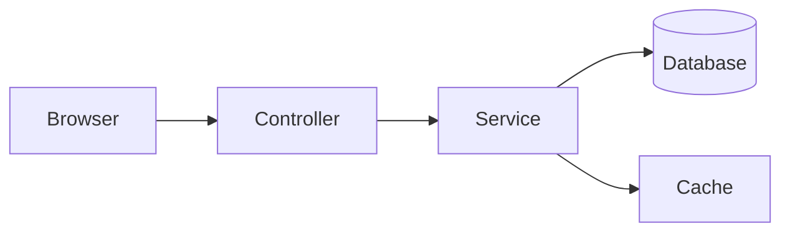
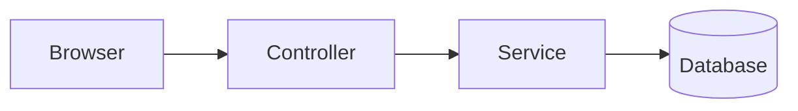

# Component Gallery

Every building block in this template, rendered live, each followed by
the markup that produced it. Copy the snippet, change the words, done.

<div class="callout note">
<div class="callout-label">Two rules before you copy</div>

1. Leave a **blank line** after an opening `<div ...>` and before its
   `</div>` whenever the inside is Markdown. Without it, mdBook treats the
   whole block as raw HTML and your `**bold**` stays literal.
2. In raw HTML (quiz options, flashcards), write `&lt;` for a literal `<`.

The [writing guide](writing-guide.md) has the full list.

</div>

## Callouts

Four flavours: `note` (information), `setup` (prerequisites, installs),
`rule` (a principle or a "do this"), `danger` (a gotcha).

<div class="callout note">
<div class="callout-label">Note</div>

Background information the reader will want, but can skip.

</div>

<div class="callout setup">
<div class="callout-label">Setup</div>

Install `curl` and open your browser's DevTools before you start.

</div>

<div class="callout rule">
<div class="callout-label">Rule of thumb</div>

Fingerprinted assets: cache for a year. HTML: revalidate every time.

</div>

<div class="callout danger">
<div class="callout-label">Gotcha</div>

`no-cache` does **not** mean "don't cache".

</div>

```html
<div class="callout note">
<div class="callout-label">Note</div>

Markdown **works** here thanks to the blank lines.

</div>
```

Swap `note` for `setup`, `rule` or `danger`. The label text is free.

## Tables

mdBook tables get the themed look automatically. Wrap them in
`.table-wrap` so wide tables scroll sideways on phones instead of
breaking the layout.

<div class="table-wrap">

| Directive | Who may store it | Revalidate? |
|---|---|---|
| `no-store` | Nobody | n/a |
| `no-cache` | Everyone | Before every use |
| `private, max-age=60` | Browser only | After 60 s |

</div>

```html
<div class="table-wrap">

| Column | Column |
|---|---|
| cell | cell |

</div>
```

## Checklist

Styled checkboxes for hands-on tasks. Ticks are remembered per page in
the reader's browser.

<ul class="checklist">
<li><label><input type="checkbox"><span>Open the <strong>Network</strong> tab in DevTools.</span></label></li>
<li><label><input type="checkbox"><span>Reload the page and find a <code>304</code> response.</span></label></li>
</ul>

```html
<ul class="checklist">
<li><label><input type="checkbox"><span>A task. <strong>HTML</strong> only in here.</span></label></li>
<li><label><input type="checkbox"><span>Another task.</span></label></li>
</ul>
```

## Level tabs

One chapter, three depths: **Overview**, **Deep Understanding**,
**Drilling**. The bar sticks to the top of the page, the reader's choice
follows them from chapter to chapter, and keys <kbd>1</kbd>
<kbd>2</kbd> <kbd>3</kbd> switch levels. A page can have only **one**
level-tabs bar, so see it live in the
[example chapter](example-chapter.md).

```html
<div class="level-tabs" data-levels>
  <button data-level="overview" aria-pressed="true">Overview</button>
  <button data-level="deep" data-short="Deep">Deep Understanding</button>
  <button data-level="drill">Drilling</button>
</div>

<div class="level overview">

Markdown for the quick version. Blank lines around it!

</div>

<div class="level deep">

### Headings stay Markdown

They show up in "On this page" while their level is active.

</div>

<div class="level drill">

Quiz, flashcards, checklist, self-checks, then the mark-done button.

</div>
```

The level names `overview`, `deep` and `drill` are fixed; the button text
is yours ("Quick look", "In depth", "Practice"...). `data-short` is the
label shown on phones. The drill tab gets a badge counting its exercises
automatically.

## Self-check with "Mark as known"

A question to answer in your head first. Opening it reveals the answer;
"Mark as known" is remembered and turns the card green.

<details class="qa">
<summary>Self-check: what does a <code>304 Not Modified</code> save?</summary>
<div class="ans">
The response body. It does not save the round trip to the server.
<div class="mark"><button type="button">Mark as known</button></div>
</div>
</details>

```html
<details class="qa">
<summary>Self-check: the question?</summary>
<div class="ans">
The answer, in HTML.
<div class="mark"><button type="button">Mark as known</button></div>
</div>
</details>
```

Leave out the `<div class="mark">` line for a plain reveal card.

## Quiz

Multiple choice with instant feedback. Wrong picks can be retried, the
explanation appears once solved, and a scoreboard above the first quiz
on the page tracks first-try answers (a perfect score earns confetti).
With focus inside a quiz, letter keys <kbd>A</kbd>–<kbd>D</kbd> pick.

<div class="quiz" data-quiz>
<p class="quiz-q">Which header value keeps a response out of every cache?</p>
<ol class="quiz-options">
<li><code>no-cache</code></li>
<li data-correct><code>no-store</code></li>
<li><code>private</code></li>
</ol>
<p class="quiz-explain"><code>no-cache</code> still stores (and revalidates); <code>private</code> only rules out shared caches.</p>
</div>

```html
<div class="quiz" data-quiz>
<p class="quiz-q">The question?</p>
<ol class="quiz-options">
<li>A wrong answer</li>
<li data-correct>The right answer</li>
<li>Another wrong answer</li>
</ol>
<p class="quiz-explain">Why the right answer is right.</p>
</div>
```

## Flashcards

One card at a time: click or <kbd>Space</kbd> flips, <kbd>&rarr;</kbd>
"got it" removes the card from the round, <kbd>&larr;</kbd> "again" puts
it at the back; <kbd>S</kbd> shuffles, <kbd>R</kbd> restarts.

<div class="flashcards" data-flashcards data-front-label="Status code" data-back-label="Meaning">
<div class="card"><div class="front"><code>200</code></div><div class="back">OK: here is the full response</div></div>
<div class="card"><div class="front"><code>304</code></div><div class="back">Not Modified: your cached copy is still good</div></div>
<div class="card"><div class="front"><code>404</code></div><div class="back">Not Found</div></div>
</div>

```html
<div class="flashcards" data-flashcards data-front-label="Term" data-back-label="Meaning">
<div class="card"><div class="front">Front text</div><div class="back">Back text</div></div>
<div class="card"><div class="front"><code>List&lt;int&gt;</code></div><div class="back">Escape &lt; in HTML</div></div>
</div>
```

`data-front-label` / `data-back-label` default to "Question" / "Answer";
`data-title` (default "Flashcards") names the deck.

## Code compare

Two or more fenced code blocks side by side; on narrow screens they turn
into tabs. Labels come from each block's language.

<div class="code-compare" data-code-compare>

```python
import requests

r = requests.get("https://example.com/")
print(r.headers.get("Cache-Control"))
```

```javascript
const r = await fetch("https://example.com/");
console.log(r.headers.get("Cache-Control"));
```

</div>

````html
<div class="code-compare" data-code-compare>

```python
print("before")
```

```javascript
console.log("after");
```

</div>
````

Optional attributes: `data-labels="Before|After"` replaces the labels,
`data-subs="v1|v2"` adds grey sub-labels, and `data-default="1"` opens
the first pane on phones (the default is the last pane, "the thing being
learned"). With three or four blocks the panes sit side by side on wide
screens.

<div class="code-compare" data-code-compare data-labels="Before|After" data-subs="no caching|cached for a day" data-default="1">

```http
Cache-Control: no-store
```

```http
Cache-Control: public, max-age=86400
```

</div>

## Progress map

The chapters of your book as a journey: done chapters turn green, the
next one pulses, and a button continues where the reader left off. It
reads the same done-state as the **Mark this chapter done** button.

<div data-progress-map data-title="This book">

- [HTTP caching in 20 minutes](example-chapter.md) A worked chapter
- [Component gallery](components.md) This page
- [Writing guide](writing-guide.md) Authoring rules

</div>

```html
<div data-progress-map>

- [Chapter one](chapter-one.md) Short blurb
- [Chapter two](chapter-two.md) Short blurb

</div>
```

Use **Markdown** links (`.md`): mdBook rewrites them to `.html`, but it
does not rewrite `href`s in raw HTML. Optional: `data-title`,
`data-label` (the word before each number, default "Chapter"),
`data-done-text` (the message once everything is done). Up to seven
stops draw as a horizontal road on wide screens.

## Pace chooser

Two sliders turn a list of tasks into a week-by-week plan. Tasks bigger
than a week's budget are split ("part 1/2"), and the reader is told how
many hours they are short.

<div class="pace-chooser" data-pace-chooser>
<ul class="pc-tasks">
<li data-hours="3">Foundations: read and take notes</li>
<li data-hours="5">Practice: exercises and quizzes</li>
<li data-hours="4">Project: build something small</li>
<li data-hours="2">Review: flashcards and self-checks</li>
</ul>
</div>

```html
<div class="pace-chooser" data-pace-chooser data-max-hours="15" data-max-weeks="12">
<ul class="pc-tasks">
<li data-hours="3">Foundations: read and take notes</li>
<li data-hours="5">Practice: exercises and quizzes</li>
</ul>
</div>
```

Text before the colon ("Foundations") labels the bars; set `data-short`
on an `<li>` to choose it yourself. Optional on the container:
`data-max-hours`, `data-max-weeks`, `data-default-hours`,
`data-default-weeks`.

## Layer explorer

A clickable stack of layers with a detail card, arrow-key navigation, and
an animated "Trace a request" dot. Great for architectures, pipelines and
request flows.

<div class="layer-explorer" data-layer-explorer data-entry="HTTP request" data-exit="Database">
<div class="layer" data-name="Controller" data-tag="HTTP in, HTTP out" data-trace="The request lands in the controller, which validates input and calls a service.">
<p>Maps URLs to handlers, parses and validates input, and turns results into responses (status codes, JSON).</p>
<p>Keep it thin: no business rules here.</p>
</div>
<div class="layer" data-name="Service" data-tag="business rules" data-trace="The service applies the business rules and asks the repository for data.">
<p>Where decisions live: permissions, calculations, workflows. Easy to unit test because it knows nothing about HTTP.</p>
</div>
<div class="layer" data-name="Repository" data-tag="data access" data-trace="The repository turns the request into a query, e.g. `SELECT ... WHERE id = ?`.">
<p>The only layer that talks to the database. Swapping storage means changing just this layer.</p>
</div>
</div>

```html
<div class="layer-explorer" data-layer-explorer data-entry="HTTP request" data-exit="Database">
<div class="layer" data-name="Controller" data-tag="HTTP in, HTTP out"
     data-trace="The request lands in the controller.">
<p>Detail HTML shown in the card when this layer is selected.</p>
</div>
<div class="layer" data-name="Service" data-tag="business rules"
     data-trace="Rules run here; `backticks` become code.">
<p>More detail.</p>
</div>
</div>
```

Leave out `data-entry` / `data-exit` to drop the end nodes. Optional:
`data-return` (caption for the trip back up) and `data-trace-label`
(button text).

## Code walkthrough

A fenced code block plus a plain numbered list. Mark the line a note is
about with a trailing `(N)` in a comment; click the badge it turns into
(or press its digit key) to read that note below the code. Works with
`//`, `#`, `--`, `;`, `%`, `/* */` and `<!-- -->`, so it reads the same
regardless of language.

<div class="code-walk" data-code-walk>

```js
function clamp(value, min, max) { // (1)
  if (value < min) return min;    // (2)
  if (value > max) return max;    // (3)
  return value;
}
```

1. Guard clauses instead of nested `if`/`else`: each condition exits immediately.
2. The lower-bound check returns `min` as soon as `value` dips below it.
3. Same idea for the upper bound; falling through both means the value was already in range.

</div>

````html
<div class="code-walk" data-code-walk>

```js
function clamp(value, min, max) { // (1)
  if (value < min) return min;    // (2)
  return value;
}
```

1. First note.
2. Second note.

</div>
````

Numbers are 1-based and must match a note's position in the list below
the code — write them in whatever order reads best. "Expand all" shows
every note stacked at once, handy for printing or a linear read.
Without JavaScript the page still reads fine: code, then a plain
numbered list of notes underneath it.

## Mermaid diagram

A plain ` ```mermaid ` fenced block — no wrapper `<div>`, the same
convention every mermaid-aware tool already uses. It's themed to match
whichever of the book's five color themes the reader has picked, and
re-renders the instant they switch themes.



````markdown

````

Drag to pan, use the toolbar's `−`/`+`/reset, <kbd>Ctrl</kbd>/<kbd>Cmd</kbd>
+ scroll, or <kbd>+</kbd>/<kbd>-</kbd>/<kbd>0</kbd> once the diagram has
focus. The `</>` button reveals the raw diagram text to copy. A typo in
the diagram shows a themed error card instead of Mermaid's default
output. Mermaid itself loads from a CDN, and only on pages that actually
have a diagram — most pages pay nothing for it.

## Diff view

One fenced ` ```diff ` block, switchable between three views: **Diff**
(colored +/− lines), **Before** (the file as it was), **After** (the
file as it is now). Paste raw `git diff` output straight in — the
`diff --git`/`index`/`---`/`+++`/`@@` boilerplate lines are recognized
and dropped from every view.

<div class="diff-view" data-diff-view>

```diff
 function clamp(value, min, max) {
-  if (value < min) return value;
+  if (value < min) return min;
   return value;
 }
```

</div>

````html
<div class="diff-view" data-diff-view>

```diff
 unchanged line
-old line
+new line
```

</div>
````

<kbd>←</kbd> <kbd>→</kbd> move between the three tabs once one has focus.
Optional: `data-labels="Before|Diff|After"` renames the buttons,
`data-default="before"` picks which view opens first (default `diff`).
Reach for **code compare** instead when you want two complete,
independently-written blocks side by side; diff view is for a single
small patch.

## Compatibility matrix

An ordinary Markdown table whose status cells start with an emoji you'd
type anyway: ✅ full support, ⚠️ partial, ❌ none. No new markup — the
raw table reads correctly with no JS at all. Text after the emoji is an
optional note; cells that have one become clickable, showing the note
below the table.

<div class="compat-matrix" data-compat-matrix>

| Feature | Chrome | Safari | Firefox |
|---|---|---|---|
| WebGPU | ✅ | ⚠️ Behind a flag until v18 | ❌ |
| Container queries | ✅ | ✅ | ✅ Since Firefox 110 |
| View transitions | ✅ Since Chrome 111 | ❌ | ❌ Tracked in bug 1823896 |

</div>

```html
<div class="compat-matrix" data-compat-matrix>

| Feature | Chrome | Safari | Firefox |
|---|---|---|---|
| WebGPU | ✅ | ⚠️ Behind a flag until v18 | ❌ |

</div>
```

Recognized glyphs: `✅`/`✓` (full), `⚠️`/`🟡` (partial), `❌`/`✗` (none).
The first column and header row are never touched, and a cell with no
recognized leading emoji is left exactly as written.

## Mark this chapter done

One per chapter, usually at the end of the drill level. On pages with
level tabs it moves into the tabs bar so it is always in reach; here it
stays where it is written. It adds a ✓ in the sidebar, updates every
progress map, and celebrates.

<button type="button" data-mark-done>Mark this chapter done</button>

```html
<button type="button" data-mark-done>Mark this chapter done</button>
```

The button text is yours; `data-done-text` sets the text once done.
